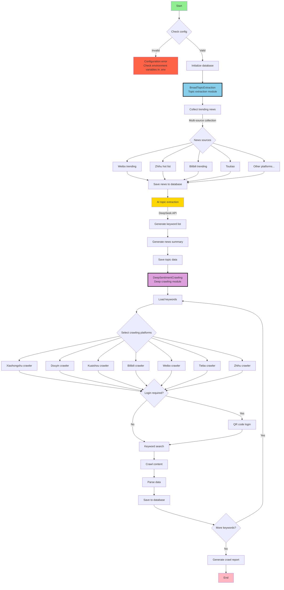

# MindSpider - An AI Crawler for Public Opinion Analysis

> Disclaimer:
> All content in this repository is for learning and reference only and is not for commercial use. No individual or organization may use this repository for illegal purposes or to infringe on the lawful rights of others. The crawling techniques in this repository are for learning and research only, and must not be used for large-scale scraping of other platforms or any other illegal behavior. This repository is not responsible for any legal liability arising from use of its content. By using this repository, you agree to all terms and conditions in this disclaimer.

## Project Overview

MindSpider is an intelligent public-opinion crawler system based on agent technology. It uses AI to identify trending topics and then performs targeted content crawling across multiple social platforms. The system is modular and supports an end-to-end automated workflow from topic discovery to content collection.

This implementation learns from and references the well-known GitHub crawler project [MediaCrawler](https://github.com/NanmiCoder/MediaCrawler).

Two-stage workflow:

- Module 1: Search Agent identifies trending news from **13** social platforms and tech communities (including Weibo, Zhihu, GitHub, Coolapk, and more), then maintains a daily topic analysis table.
- Module 2: A full-platform crawler performs deep crawling for fine-grained sentiment feedback on each topic.

<div align="center">


MindSpider runtime example
</div>

### Technical Stack

- **Language**: Python 3.9+
- **AI Framework**: DeepSeek by default, with support for multiple APIs (topic extraction and analysis)
- **Crawler Framework**: Playwright (browser automation)
- **Database**: MySQL / PostgreSQL (persistent storage)
- **Concurrency**: AsyncIO (asynchronous crawling)

## Project Structure

```text
MindSpider/
├── BroadTopicExtraction/           # Topic extraction module
│   ├── database_manager.py         # Database manager
│   ├── get_today_news.py           # News collector
│   ├── main.py                     # Module entry point
│   └── topic_extractor.py          # AI topic extractor
│
├── DeepSentimentCrawling/          # Deep crawling module
│   ├── keyword_manager.py          # Keyword manager
│   ├── main.py                     # Module entry point
│   ├── platform_crawler.py         # Platform crawler manager
│   └── MediaCrawler/               # Multi-platform crawler core
│       ├── base/                   # Base classes
│       ├── cache/                  # Cache system
│       ├── config/                 # Configuration
│       ├── media_platform/         # Platform implementations
│       │   ├── bilibili/           # Bilibili crawler
│       │   ├── douyin/             # Douyin crawler
│       │   ├── kuaishou/           # Kuaishou crawler
│       │   ├── tieba/              # Tieba crawler
│       │   ├── weibo/              # Weibo crawler
│       │   ├── xhs/                # Xiaohongshu crawler
│       │   └── zhihu/              # Zhihu crawler
│       ├── model/                  # Data models
│       ├── proxy/                  # Proxy management
│       ├── store/                  # Storage layer
│       └── tools/                  # Utilities
│
├── schema/                         # Database schema
│   ├── db_manager.py               # Database manager
│   ├── init_database.py            # Initialization script
│   └── mindspider_tables.sql       # Table definitions
│
├── config.py                       # Global configuration
├── main.py                         # System entry point
├── requirements.txt                # Dependency list
└── README.md                       # Project documentation
```

## System Workflow

### Overall Architecture Flowchart



### Workflow Details

#### 1. BroadTopicExtraction (Topic Extraction Module)

This module discovers and extracts daily trending topics:

1. **News Collection**: Collect trending news from major platforms (Weibo, Zhihu, Bilibili, etc.)
2. **AI Analysis**: Analyze news using the DeepSeek API
3. **Topic Extraction**: Identify hot topics and generate related keywords
4. **Data Storage**: Save topics and keywords to MySQL

#### 2. DeepSentimentCrawling (Deep Crawling Module)

This module performs deep crawling based on extracted topic keywords:

1. **Load Keywords**: Read daily keywords from the database
2. **Platform Crawling**: Use Playwright to crawl seven platforms
3. **Content Parsing**: Extract posts, comments, and interaction metrics
4. **Sentiment Analysis**: Analyze sentiment tendency of crawled content
5. **Persistence**: Save structured data to the database

## Database Architecture

### Core Tables

1. **daily_news** - Daily news table
   - Stores trending news collected from platforms
   - Includes title, link, description, ranking, and more

2. **daily_topics** - Daily topic table
   - Stores AI-extracted topics and keywords
   - Includes topic name, description, keyword list, and more

3. **topic_news_relation** - Topic-news relation table
   - Tracks relationships between topics and news items
   - Includes relevance score

4. **crawling_tasks** - Crawling task table
   - Manages crawling tasks for each platform
   - Records task status, progress, and results

5. **Platform content tables** (inherited from MediaCrawler)
   - xhs_note - Xiaohongshu notes
   - douyin_aweme - Douyin videos
   - kuaishou_video - Kuaishou videos
   - bilibili_video - Bilibili videos
   - weibo_note - Weibo posts
   - tieba_note - Tieba posts
   - zhihu_content - Zhihu content

## Installation and Deployment

### Requirements

- Python 3.9 or newer
- MySQL 5.7+ or PostgreSQL
- Conda environment: pytorch_python11 (recommended)
- OS: Windows/Linux/macOS

### 1. Clone Project and Fetch Submodules

MindSpider runs as a core component of BettaFish. Clone the BettaFish repository and fetch the MediaCrawler submodule.

**Option A: Clone with submodules (recommended)**

```bash
git clone --recurse-submodules https://github.com/666ghj/BettaFish.git
cd BettaFish/MindSpider
```

**Option B: Initialize submodules after cloning**

If you already cloned BettaFish but `MindSpider/DeepSentimentCrawling/MediaCrawler` is empty, run this from the **project root**:

```bash
git submodule update --init --recursive
```

> **Note**: MediaCrawler Python dependencies are automatically detected and installed into the current environment on first run of `uv run main.py --deep-sentiment`.

### 2. Create and Activate Environment

#### Conda Setup

```bash
# Create a conda environment named pytorch_python11 with Python 3.11
conda create -n pytorch_python11 python=3.11
# Activate the environment
conda activate pytorch_python11
```

#### UV Setup

> [UV is a fast and lightweight Python environment/package manager: https://github.com/astral-sh/uv]

- Install uv (if not installed):

```bash
pip install uv
```

- Create and activate a virtual environment:

```bash
uv venv --python 3.11  # Create Python 3.11 environment
source .venv/bin/activate   # Linux/macOS
# or
.venv\Scripts\activate      # Windows
```

### 3. Install Dependencies

```bash
# Install Python dependencies
pip install -r requirements.txt

# Or use uv for faster installation
uv pip install -r requirements.txt

# Install Playwright browser binaries
playwright install
```

### 4. Configure the System

Copy `.env.example` to `.env` in the project root, then edit `.env` with your database and API settings:

```python
# Database settings (MySQL example)
DB_DIALECT = "mysql"       # mysql or postgresql
DB_HOST = "your_database_host"
DB_PORT = 3306
DB_USER = "your_username"
DB_PASSWORD = "your_password"
DB_NAME = "mindspider"
DB_CHARSET = "utf8mb4"     # optional when using PostgreSQL

# PostgreSQL example (set DB_DIALECT to postgresql and DB_PORT to 5432)
# DB_DIALECT = "postgresql"
# DB_PORT = 5432

# MINDSPIDER API settings
MINDSPIDER_BASE_URL=your_api_base_url
MINDSPIDER_API_KEY=sk-your-key
MINDSPIDER_MODEL_NAME=deepseek-chat
```

### 5. Initialize the System

```bash
# Check system status
python main.py --status
# or
uv run main.py --status
```

## Usage

### Complete Workflow

```bash
# 1. Run topic extraction (collect hot news and keywords)
python main.py --broad-topic
# or
uv run main.py --broad-topic

# 2. Run crawler (crawl content based on keywords)
python main.py --deep-sentiment --test
# or
uv run main.py --deep-sentiment --test

# Or run full workflow in one command
python main.py --complete --test
# or
uv run main.py --complete --test
```

### Run Modules Separately

```bash
# Extract today's hot topics and keywords only
python main.py --broad-topic
# or
uv run main.py --broad-topic

# Crawl only selected platforms
python main.py --deep-sentiment --platforms xhs dy --test
# or
uv run main.py --deep-sentiment --platforms xhs dy --test

# Specify date
python main.py --broad-topic --date 2024-01-15
# or
uv run main.py --broad-topic --date 2024-01-15
```

## Crawler Configuration (Important)

### Platform Login Setup

**Each platform requires first-time login. This is the most important setup step.**

1. **Xiaohongshu login**

```bash
# Test Xiaohongshu crawl (QR code will appear)
python main.py --deep-sentiment --platforms xhs --test
# or
uv run main.py --deep-sentiment --platforms xhs --test
# Use the Xiaohongshu app to scan and log in; session state is saved automatically
```

2. **Douyin login**

```bash
# Test Douyin crawl
python main.py --deep-sentiment --platforms dy --test
# or
uv run main.py --deep-sentiment --platforms dy --test
# Use the Douyin app to scan and log in
```

3. **Other platforms are similar**

```bash
# Kuaishou
uv run main.py --deep-sentiment --platforms ks --test

# Bilibili
uv run main.py --deep-sentiment --platforms bili --test

# Weibo
uv run main.py --deep-sentiment --platforms wb --test

# Tieba
uv run main.py --deep-sentiment --platforms tieba --test

# Zhihu
uv run main.py --deep-sentiment --platforms zhihu --test
```

### Login Troubleshooting

**If login fails or hangs:**

1. **Check network**: Make sure the target platform is reachable
2. **Disable headless mode**: Edit `DeepSentimentCrawling/MediaCrawler/config/base_config.py`

   ```python
   HEADLESS = False  # Show browser window
   ```

3. **Handle verification manually**: Some platforms require manual slider/captcha actions
4. **Re-login**: Delete `DeepSentimentCrawling/MediaCrawler/browser_data/` and log in again

### Other Issues

https://github.com/666ghj/BettaFish/issues/185

### Crawling Parameter Tuning

Adjust crawling parameters before production use:

```bash
# Small-scale test (recommended first)
python main.py --complete --test
# or
uv run main.py --complete --test

# Adjust crawl volume
python main.py --complete --max-keywords 20 --max-notes 30
# or
uv run main.py --complete --max-keywords 20 --max-notes 30
```

### Advanced Features

#### 1. Date-specific operations

```bash
# Extract topics for a specific date
python main.py --broad-topic --date 2024-01-15
# or
uv run main.py --broad-topic --date 2024-01-15

# Crawl content for a specific date
python main.py --deep-sentiment --date 2024-01-15
# or
uv run main.py --deep-sentiment --date 2024-01-15
```

#### 2. Platform-specific crawling

```bash
# Crawl only Bilibili and Douyin
python main.py --deep-sentiment --platforms bili dy --test
# or
uv run main.py --deep-sentiment --platforms bili dy --test

# Crawl all platforms with capped volume
python main.py --deep-sentiment --max-keywords 30 --max-notes 20
# or
uv run main.py --deep-sentiment --max-keywords 30 --max-notes 20
```

## Common CLI Arguments

```bash
--status              # Check project status
--setup               # Initialize project (deprecated, now auto-init)
--broad-topic         # Topic extraction module
--deep-sentiment      # Crawling module
--complete            # Full workflow
--test                # Test mode (small dataset)
--platforms xhs dy    # Specify platforms
--date 2024-01-15     # Specify date
```

## Supported Platforms

| Code | Platform | Code | Platform |
|-----|-----|-----|-----|
| xhs | Xiaohongshu | wb | Weibo |
| dy | Douyin | tieba | Tieba |
| ks | Kuaishou | zhihu | Zhihu |
| bili | Bilibili | | |

## FAQ

### 1. Platform login failed

```bash
# Issue: QR code does not appear or login fails
# Fix: Disable headless mode and login manually
# Edit: DeepSentimentCrawling/MediaCrawler/config/base_config.py
HEADLESS = False

# Retry login
python main.py --deep-sentiment --platforms xhs --test
# or
uv run main.py --deep-sentiment --platforms xhs --test
```

### 2. Database connection failed

```bash
# Check configuration
python main.py --status
# or
uv run main.py --status

# Verify database settings in config.py
```

### 3. Playwright installation failed

```bash
# Reinstall
pip install playwright

# or
uv pip install playwright

playwright install
```

### 4. Crawled data is empty

- Make sure platform login has completed successfully
- Check whether keywords exist (run topic extraction first)
- Use test mode to validate: `--test`

### 5. API call failed

- Check whether DeepSeek API key is correct
- Confirm API quota is sufficient

## Notes

1. First-time use requires login for each platform
2. Test mode is strongly recommended before large runs
3. Follow platform terms and rules
4. For learning and research use only

## Development Guide

### Add a new news source

Add a new source in `BroadTopicExtraction/get_today_news.py`:

```python
async def get_new_platform_news(self) -> List[Dict]:
    """Get trending news from a new platform."""
    # Implement news collection logic
    pass
```

### Add a new crawler platform

1. Create a new platform directory under `DeepSentimentCrawling/MediaCrawler/media_platform/`
2. Implement these core modules:
   - `client.py`: API client
   - `core.py`: Core crawler logic
   - `login.py`: Login workflow
   - `field.py`: Data field definitions

### Database extension

To add new tables or fields, update `schema/mindspider_tables.sql` and run:

```bash
python schema/init_database.py
```

## Performance Optimization

1. **Database optimization**
   - Clean historical data regularly
   - Add indexes for high-frequency query fields
   - Consider partitioned tables for large data volumes

2. **Crawling optimization**
   - Use reasonable crawl intervals to reduce rate limits
   - Use a proxy pool to improve stability
   - Control concurrency to avoid resource exhaustion

3. **System optimization**
   - Cache hot data with Redis
   - Use async task queues for long-running operations
   - Monitor system resource usage regularly

## API Usage

The project provides Python APIs for extension:

```python
from BroadTopicExtraction import BroadTopicExtraction
from DeepSentimentCrawling import DeepSentimentCrawling

# Topic extraction
async def extract_topics():
    extractor = BroadTopicExtraction()
    result = await extractor.run_daily_extraction()
    return result

# Content crawling
def crawl_content():
    crawler = DeepSentimentCrawling()
    result = crawler.run_daily_crawling(
        platforms=['xhs', 'dy'],
        max_keywords=50,
        max_notes=30
    )
    return result
```

## License

This project is for learning and research only. Do not use it for commercial purposes. When using this project, follow all applicable laws, regulations, and platform terms of service.

---

**MindSpider** - Let AI power public-opinion insight and intelligent content analysis.